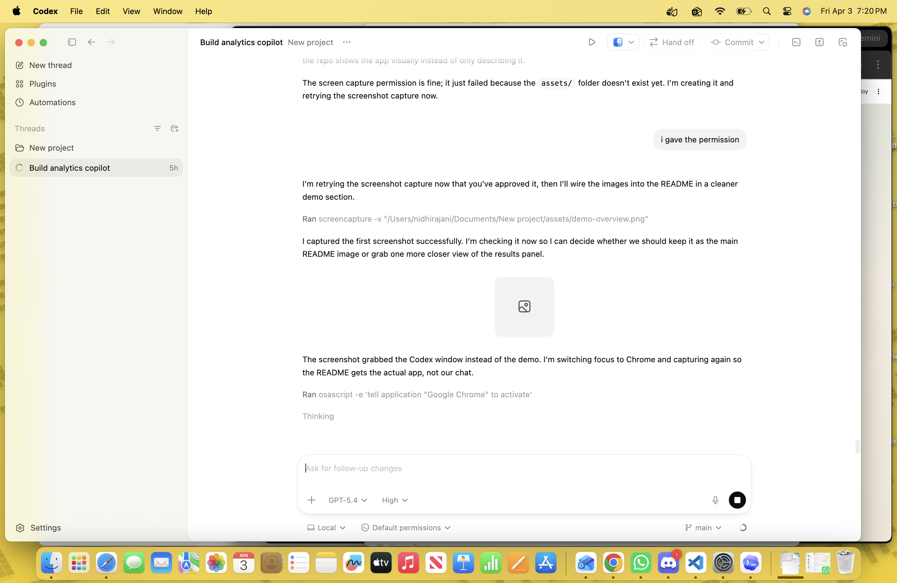
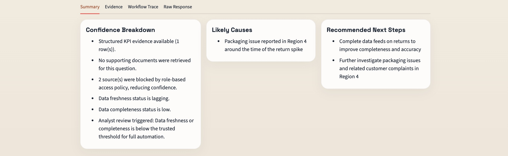
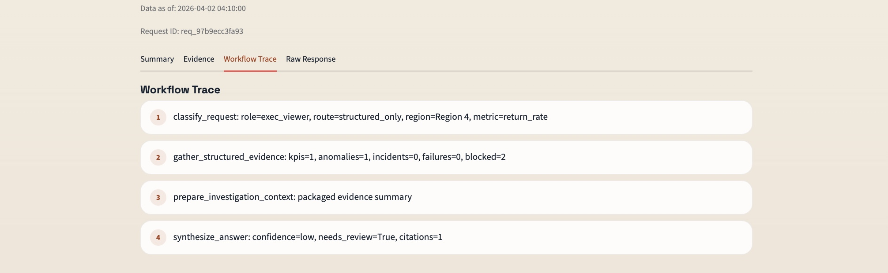
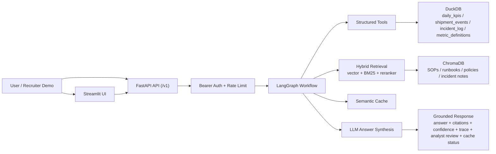

# Agentic Analytics Copilot for Enterprise Operations

Production-style internal AI system for KPI anomaly investigation across structured operational data and unstructured business knowledge.

## Problem Statement

Operations and analytics teams lose time investigating KPI drops across dashboards, raw events, incident logs, SOPs, and escalation policies. This project simulates an internal AI copilot that helps answer investigation questions such as:

- Why did delivery success rate drop in Region 3 yesterday?
- Which KPI moved abnormally this week?
- What does the runbook suggest we do next?
- When should this case be escalated to an analyst?

The goal is not to build a generic chatbot. The goal is to build a grounded, traceable, evaluation-aware workflow that looks closer to what enterprise AI teams are actually shipping.

## What The System Does

The system accepts a business investigation question through a versioned FastAPI API, authenticates the caller with a bearer token, routes the request through a LangGraph workflow, gathers evidence from both DuckDB tables and hybrid-retrieved ChromaDB documents, and produces a grounded answer with citations, confidence, trace steps, cache metadata, and analyst-review fallback.

## Demo Preview

### Live deployment

- Streamlit app: [https://agentic-analytics-streamlit.onrender.com](https://agentic-analytics-streamlit.onrender.com)
- FastAPI API: [https://agentic-analytics-api.onrender.com](https://agentic-analytics-api.onrender.com)
- API docs: [https://agentic-analytics-api.onrender.com/docs](https://agentic-analytics-api.onrender.com/docs)

### Streamlit overview



The current demo flow highlights:

- role-aware investigation from the sidebar
- grounded answer output with confidence and analyst-review status
- freshness and completeness signals for partial or lagging data
- blocked-source handling for restricted roles

### Confidence breakdown



The breakdown panel explains why a case is high, medium, or low confidence using evidence availability, blocked sources, freshness, completeness, and analyst-review triggers.

### Workflow trace



The workflow trace makes the orchestration path visible step by step, which is especially useful for debugging and for explaining the system clearly in interviews.

## Architecture



## Core Features

- Natural-language KPI investigation over structured operational data
- Raw-to-curated data pipeline that turns messy operational feeds into agent-ready serving tables
- Data quality checks for duplicates, normalization, metric coverage, freshness values, completeness bounds, and policy uniqueness
- Retrieval over metric definitions, SOPs, runbooks, policies, and incident notes
- Hybrid document retrieval using vector search, BM25 keyword scoring, reciprocal rank fusion, and reranking
- LangGraph-based routing for structured-only, document-only, and hybrid questions
- Role-aware access control across structured and unstructured sources
- Versioned `/v1` API routes with bearer-token auth and request rate limiting
- Grounded answer generation with citations
- Confidence labels, confidence breakdown, analyst-review reasons, and `needs_analyst_review` fallback
- Freshness and completeness-aware investigation outputs
- Semantic cache with cache hit/miss metadata for repeated questions
- Request observability persisted to a local metrics store, with optional Langfuse tracing hooks
- Streaming investigation endpoint for progressive answer delivery
- Workflow trace endpoint for debugging orchestration decisions
- Streamlit demo UI for recruiter-friendly exploration
- Local evaluation harness for route correctness, citations, trace depth, freshness, blocked-source expectations, and retrieval quality
- Dockerized local startup path

## Tech Stack

### Backend and API

- `Python`
- `FastAPI`
- `Pydantic`

### Demo UI

- `Streamlit`
- `httpx`

### Structured Data

- `DuckDB`
- CSV seed datasets for KPI, shipment, incident, metric-definition, and access-policy tables

### Unstructured Retrieval

- `ChromaDB`
- OpenAI embeddings via `text-embedding-3-small`
- `rank-bm25`
- sentence-transformers cross-encoder reranker

### Orchestration and LLM

- `LangGraph`
- OpenAI chat completions via `gpt-4.1-mini`

### Reliability and Evaluation

- structured logging
- semantic cache
- request metrics store backed by SQLite
- `pytest`
- custom eval harness in `evals/run_eval.py`
- optional LLM-as-judge scoring in `evals/llm_judge.py`
- GitHub Actions CI with an eval gate

### Packaging

- `Docker`
- `docker-compose`

## Data Sources

This MVP uses synthetic but realistic internal operations data.

The agent-facing serving tables are rebuilt from a simulated raw bronze layer:

- `data/raw/bronze/kpi_feed.csv`
- `data/raw/bronze/shipment_event_feed.csv`
- `data/raw/bronze/incident_feed.csv`
- `data/raw/bronze/metric_catalog.csv`

Those raw feeds intentionally include duplicates, inconsistent region names, inconsistent metric names, and delayed timestamps.

The curated serving tables are:

- `daily_kpis`
- `shipment_events`
- `incident_log`
- `metric_definitions`

It also includes unstructured business knowledge:

- metric definition docs
- anomaly investigation SOP
- delivery disruption runbook
- escalation policy
- incident review note

## Request Flow

1. User submits a business question to `POST /v1/ask`
2. Raw bronze feeds are normalized into curated CSV serving tables through `scripts/build_curated_data.py`
3. Data quality checks validate the curated layer before DuckDB is rebuilt
4. Bearer-token auth determines the caller role and rate limiting protects the API surface
5. Request role determines which structured resources and doc groups are allowed
6. Semantic cache checks whether a highly similar question was answered recently for the same role
7. Router classifies the question as structured, document, or hybrid
8. Workflow extracts region and metric where possible
9. Structured tools fetch KPI, anomaly, incident, and failure evidence from DuckDB only if access policy allows it
10. Retrieval layer fetches document candidates from ChromaDB, merges vector and keyword rankings, reranks the fused result set, and filters restricted sources
11. LLM synthesizes an answer strictly from gathered evidence
12. Guardrails attach confidence, confidence breakdown, freshness/completeness status, blocked-source trace, citations, cache metadata, and analyst-review fallback

## API Endpoints

- `GET /v1/health`: health check and runtime config visibility
- `POST /v1/ask`: primary investigation endpoint
- `GET /v1/debug/trace`: inspect routing and workflow trace for a question
- `GET /v1/debug/metrics`: operational dashboard summary for recent requests
- `POST /v1/ask/stream`: server-sent events stream for progressive answer delivery

Direct API calls now require a bearer token. The local Streamlit demo generates demo tokens automatically based on the selected role. If you want to test the API manually, you can mint a local demo token with:

```bash
python -c "from app.core.auth import create_demo_token; print(create_demo_token('operations_analyst'))"
```

## Demo Experience

The repo now includes a simple Streamlit app in `frontend/streamlit_app.py` that calls the FastAPI backend and renders:

- answer summary
- selected user role
- confidence and analyst-review status
- confidence breakdown
- freshness and completeness status
- likely causes
- recommended next steps
- citations
- blocked sources
- workflow trace
- request ID and latency
- cache status
- ops metrics dashboard with latency, cache hit rate, token totals, and estimated cost
- raw JSON response

## Example Questions

- Why did delivery success rate drop in Region 3 on 2026-03-31?
- What does the escalation policy say about low-confidence cases?
- Why did delivery success rate drop in Region 3 and what does the SOP suggest we do next?
- Explain the return rate spike in Region 4.
- Which KPIs moved abnormally this week?

## Evaluation Approach

This project includes two layers of quality checks:

### Unit and integration-oriented tests

- routing logic
- chunking behavior
- answer guardrails
- workflow failure fallback
- service-layer mapping

Current local result:

- `24/24` tests passing

### Starter eval harness

The eval harness in `evals/run_eval.py` checks:

- route detection
- metric and region extraction
- citation presence
- trace depth
- answer presence
- freshness detection
- blocked-source expectations by role
- retrieval precision and recall against gold doc-group labels
- optional LLM-as-judge scoring for faithfulness, completeness, and citation accuracy

Current local starter result:

| Metric | Result |
|---|---|
| Eval cases | 31 |
| Test suite | 26/26 passing |
| Coverage | route, trace, citations, freshness, blocked-source handling, answer presence, retrieval precision/recall |

The eval runner also supports a minimum-score gate through `EVAL_MIN_AVG_SCORE`, which is used by CI when `OPENAI_API_KEY` is configured as a repository secret.

## Project Structure

```text
app/
  api/
    v1/             # versioned FastAPI routes
  core/             # config, auth, caching, and logging
  db/               # DuckDB setup
  llm/              # prompts and answer synthesis
  orchestration/    # LangGraph workflow
  retrieval/        # chunking, hybrid retrieval, and reranking
  schemas/          # request/response models
  services/         # business logic
  tools/            # agent-callable tools
data/
  cache/            # local semantic cache SQLite file (runtime-generated, gitignored)
  raw/              # messy bronze-style feeds used to rebuild curated sources
  docs/             # SOPs, runbooks, policies, notes
  structured/       # source CSVs and DuckDB file
  vector/           # ChromaDB persistence
evals/
  datasets/         # evaluation questions and gold retrieval labels
  llm_judge.py      # optional judge scoring
frontend/
  streamlit_app.py  # lightweight demo UI
.github/
  workflows/        # CI checks
render.yaml         # Render deployment scaffolding for the API and Streamlit demo
tests/              # unit and workflow tests
```

## How To Run

### 1. Create and activate a virtual environment

```bash
python3 -m venv .venv
source .venv/bin/activate
```

### 2. Install dependencies

```bash
python -m pip install -e ".[dev]"
```

### 3. Configure environment variables

Create `.env` from the sample file:

```bash
cp .env.example .env
```

Then add your OpenAI API key to `.env`:

```env
OPENAI_API_KEY=sk-...
JWT_SECRET=replace-me
```

Langfuse is optional. If you want cloud traces for prompts, tokens, and cost metadata, also set:

```env
LANGFUSE_PUBLIC_KEY=pk-...
LANGFUSE_SECRET_KEY=sk-...
LANGFUSE_HOST=https://cloud.langfuse.com
```

### 4. Initialize data stores

```bash
python scripts/build_curated_data.py
python scripts/run_data_quality_checks.py
python scripts/init_duckdb.py
python scripts/index_documents.py
```

`python scripts/init_duckdb.py` already rebuilds curated data and runs the quality checks before recreating DuckDB, so the first two commands are optional if you want the one-step path.

### 5. Run the API

```bash
python -m uvicorn app.main:app --reload
```

### 6. Run the Streamlit demo

In a second terminal:

```bash
streamlit run frontend/streamlit_app.py
```

### 7. Open the app surfaces

Visit:

```text
http://127.0.0.1:8000/docs
```

And for Streamlit:

```text
http://localhost:8501
```

Hosted deployment:

```text
https://agentic-analytics-api.onrender.com/docs
https://agentic-analytics-streamlit.onrender.com
```

### 8. Run tests and evals

```bash
python -m pytest
python evals/run_eval.py
```

## Sample Output Shape

The `POST /v1/ask` endpoint returns:

- `answer`
- `role`
- `confidence`
- `confidence_breakdown`
- `needs_analyst_review`
- `analyst_review_reason`
- `likely_causes`
- `recommended_next_steps`
- `citations`
- `trace`
- `evidence_summary`
- `blocked_sources`
- `data_as_of`
- `freshness_status`
- `completeness_status`
- `request_id`
- `latency_ms`
- `cache_status`

The streaming variant at `POST /v1/ask/stream` emits server-sent events in this order:

- `status` when the workflow starts
- `status` again when the final answer payload is ready
- repeated `answer_chunk` events for progressive text rendering
- `complete` with the full JSON payload

## Limitations

- The current dataset is synthetic and intentionally small, even though it now includes a raw-to-curated simulation layer
- Eval coverage is much stronger than the original starter harness, but it is still not a full production regression suite
- Confidence logic is heuristic and should be calibrated further
- The reranker and hybrid retrieval stack are optimized for local prototyping, not for large-scale production latency budgets yet
- The vector index is generated locally and intentionally excluded from source control
- Auth is currently a local bearer-token demo flow, not an external identity provider or SSO integration
- Langfuse hooks are optional and only activate when Langfuse credentials are configured
- The current interface is a polished demo UI, not a fully deployed internal product

## Production Considerations

In a real enterprise setting, the AI workflow should not sit directly on top of raw operational logs. A production version would usually place the agent on top of curated, quality-checked serving tables and documented business knowledge.

Key production concerns:

- raw source data is often incomplete, duplicated, delayed, or inconsistent
- raw-to-curated transforms should be observable and rerunnable
- late-arriving events can make current-day metrics temporarily unreliable
- freshness and completeness metadata should be propagated into confidence scoring
- low-quality or stale data should lower confidence and increase analyst-review routing
- upstream schema changes and broken joins should be detected before data reaches the AI layer
- the system should automate triage and evidence gathering, not assume every operational decision can be safely auto-executed

## Why This Project Is Useful For Applied AI Roles

This project demonstrates:

- grounded retrieval across structured and unstructured data
- agent workflow orchestration instead of single-shot prompting
- reliability features like logging, traces, fallbacks, and structured outputs
- evaluation-aware development instead of demo-only development
- enterprise-style framing around business workflows and analyst review

## Future Work

- external identity provider integration instead of demo bearer tokens
- true parallel document and structured retrieval orchestration at larger scale
- deployed live environment with CI-driven eval gates
- richer SQL drafting and deeper investigation mode
- dashboard integration or incident-ticket integration

## Deployment

The repo now includes [render.yaml](/Users/nidhirajani/Documents/New%20project/render.yaml) with separate services for:

- the FastAPI backend
- the Streamlit demo UI

To deploy on Render:

1. Create a new Blueprint deployment from the repo.
2. Add `OPENAI_API_KEY` in the Render environment.
3. Optionally add Langfuse keys for hosted tracing.
4. Deploy both services from the generated blueprint.

This environment does not have access to your Render or Railway account, so the live URL still needs to be created from your side after the config is pushed.

Current live URLs:

- Streamlit app: [https://agentic-analytics-streamlit.onrender.com](https://agentic-analytics-streamlit.onrender.com)
- FastAPI API: [https://agentic-analytics-api.onrender.com](https://agentic-analytics-api.onrender.com)
- API docs: [https://agentic-analytics-api.onrender.com/docs](https://agentic-analytics-api.onrender.com/docs)
