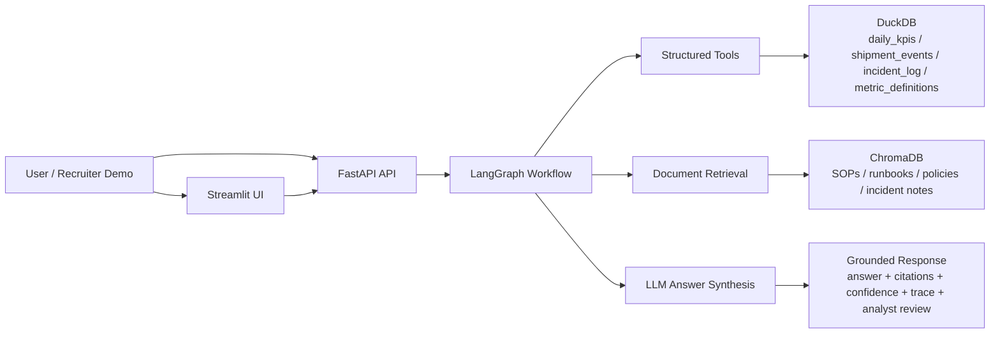

# Agentic Analytics Copilot for Enterprise Operations

Production-style internal AI system for KPI anomaly investigation across structured operational data and unstructured business knowledge.

## Problem Statement

Operations and analytics teams lose time investigating KPI drops across dashboards, raw events, incident logs, SOPs, and escalation policies. This project simulates an internal AI copilot that helps answer investigation questions such as:

- Why did delivery success rate drop in Region 3 yesterday?
- Which KPI moved abnormally this week?
- What does the runbook suggest we do next?
- When should this case be escalated to an analyst?

The goal is not to build a generic chatbot. The goal is to build a grounded, traceable, evaluation-aware workflow that looks closer to what enterprise AI teams are actually shipping.

## What The System Does

The system accepts a business investigation question through a FastAPI endpoint, routes the request through a LangGraph workflow, gathers evidence from both DuckDB tables and ChromaDB-retrieved documents, and produces a grounded answer with citations, confidence, trace steps, and analyst-review fallback.

## Architecture



## Core Features

- Natural-language KPI investigation over structured operational data
- Raw-to-curated data pipeline that turns messy operational feeds into agent-ready serving tables
- Data quality checks for duplicates, normalization, metric coverage, freshness values, completeness bounds, and policy uniqueness
- Retrieval over metric definitions, SOPs, runbooks, policies, and incident notes
- LangGraph-based routing for structured-only, document-only, and hybrid questions
- Role-aware access control across structured and unstructured sources
- Grounded answer generation with citations
- Confidence labels, confidence breakdown, analyst-review reasons, and `needs_analyst_review` fallback
- Freshness and completeness-aware investigation outputs
- Workflow trace endpoint for debugging orchestration decisions
- Streamlit demo UI for recruiter-friendly exploration
- Local evaluation harness for route correctness, citations, trace depth, and answer presence
- Dockerized local startup path

## Tech Stack

### Backend and API

- `Python`
- `FastAPI`
- `Pydantic`

### Demo UI

- `Streamlit`
- `httpx`

### Structured Data

- `DuckDB`
- CSV seed datasets for KPI, shipment, incident, metric-definition, and access-policy tables

### Unstructured Retrieval

- `ChromaDB`
- OpenAI embeddings via `text-embedding-3-small`

### Orchestration and LLM

- `LangGraph`
- OpenAI chat completions via `gpt-4.1-mini`

### Reliability and Evaluation

- structured logging
- `pytest`
- custom eval harness in `evals/run_eval.py`

### Packaging

- `Docker`
- `docker-compose`

## Data Sources

This MVP uses synthetic but realistic internal operations data.

The agent-facing serving tables are rebuilt from a simulated raw bronze layer:

- `data/raw/bronze/kpi_feed.csv`
- `data/raw/bronze/shipment_event_feed.csv`
- `data/raw/bronze/incident_feed.csv`
- `data/raw/bronze/metric_catalog.csv`

Those raw feeds intentionally include duplicates, inconsistent region names, inconsistent metric names, and delayed timestamps.

The curated serving tables are:

- `daily_kpis`
- `shipment_events`
- `incident_log`
- `metric_definitions`

It also includes unstructured business knowledge:

- metric definition docs
- anomaly investigation SOP
- delivery disruption runbook
- escalation policy
- incident review note

## Request Flow

1. User submits a business question to `POST /ask`
2. Raw bronze feeds are normalized into curated CSV serving tables through `scripts/build_curated_data.py`
3. Data quality checks validate the curated layer before DuckDB is rebuilt
4. Request role determines which structured resources and doc groups are allowed
5. Router classifies the question as structured, document, or hybrid
6. Workflow extracts region and metric where possible
7. Structured tools fetch KPI, anomaly, incident, and failure evidence from DuckDB only if access policy allows it
8. Retrieval layer fetches relevant document chunks from ChromaDB and filters restricted sources
9. LLM synthesizes an answer strictly from gathered evidence
10. Guardrails attach confidence, confidence breakdown, freshness/completeness status, blocked-source trace, citations, and analyst-review fallback

## API Endpoints

- `GET /health`: health check and runtime config visibility
- `POST /ask`: primary investigation endpoint
- `GET /debug/trace`: inspect routing and workflow trace for a question

## Demo Experience

The repo now includes a simple Streamlit app in `frontend/streamlit_app.py` that calls the FastAPI backend and renders:

- answer summary
- selected user role
- confidence and analyst-review status
- confidence breakdown
- freshness and completeness status
- likely causes
- recommended next steps
- citations
- blocked sources
- workflow trace
- request ID and latency
- raw JSON response

## Example Questions

- Why did delivery success rate drop in Region 3 on 2026-03-31?
- What does the escalation policy say about low-confidence cases?
- Why did delivery success rate drop in Region 3 and what does the SOP suggest we do next?
- Explain the return rate spike in Region 4.
- Which KPIs moved abnormally this week?

## Evaluation Approach

This project includes two layers of quality checks:

### Unit and integration-oriented tests

- routing logic
- chunking behavior
- answer guardrails
- workflow failure fallback
- service-layer mapping

Current local result:

- `17/17` tests passing

### Starter eval harness

The eval harness in `evals/run_eval.py` checks:

- route detection
- metric and region extraction
- citation presence
- trace depth
- answer presence
- freshness detection
- blocked-source expectations by role

Current local starter result:

| Metric | Result |
|---|---|
| Eval cases | 8 |
| Average score | 1.0 |
| Coverage | route, trace, citations, freshness, blocked-source handling, answer presence |

This is intentionally a small MVP eval set, not a claim of full production readiness.

## Project Structure

```text
app/
  api/              # FastAPI routes
  core/             # config and logging
  db/               # DuckDB setup
  llm/              # prompts and answer synthesis
  orchestration/    # LangGraph workflow
  retrieval/        # chunking and ChromaDB access
  schemas/          # request/response models
  services/         # business logic
  tools/            # agent-callable tools
data/
  raw/              # messy bronze-style feeds used to rebuild curated sources
  docs/             # SOPs, runbooks, policies, notes
  structured/       # source CSVs and DuckDB file
  vector/           # ChromaDB persistence
evals/
  datasets/         # evaluation questions
frontend/
  streamlit_app.py  # lightweight demo UI
tests/              # unit and workflow tests
```

## How To Run

### 1. Create and activate a virtual environment

```bash
python3 -m venv .venv
source .venv/bin/activate
```

### 2. Install dependencies

```bash
python -m pip install -e ".[dev]"
```

### 3. Configure environment variables

Create `.env` from the sample file:

```bash
cp .env.example .env
```

Then add your OpenAI API key to `.env`:

```env
OPENAI_API_KEY=sk-...
```

### 4. Initialize data stores

```bash
python scripts/build_curated_data.py
python scripts/run_data_quality_checks.py
python scripts/init_duckdb.py
python scripts/index_documents.py
```

`python scripts/init_duckdb.py` already rebuilds curated data and runs the quality checks before recreating DuckDB, so the first two commands are optional if you want the one-step path.

### 5. Run the API

```bash
python -m uvicorn app.main:app --reload
```

### 6. Run the Streamlit demo

In a second terminal:

```bash
streamlit run frontend/streamlit_app.py
```

### 7. Open the app surfaces

Visit:

```text
http://127.0.0.1:8000/docs
```

And for Streamlit:

```text
http://localhost:8501
```

### 8. Run tests and evals

```bash
python -m pytest
python evals/run_eval.py
```

## Sample Output Shape

The `POST /ask` endpoint returns:

- `answer`
- `role`
- `confidence`
- `confidence_breakdown`
- `needs_analyst_review`
- `analyst_review_reason`
- `likely_causes`
- `recommended_next_steps`
- `citations`
- `trace`
- `evidence_summary`
- `blocked_sources`
- `data_as_of`
- `freshness_status`
- `completeness_status`
- `request_id`
- `latency_ms`

## Limitations

- The current dataset is synthetic and intentionally small, even though it now includes a raw-to-curated simulation layer
- Eval coverage is still a starter harness rather than a large regression suite
- Confidence logic is heuristic and should be calibrated further
- Retrieval currently uses a simple chunking strategy without reranking
- The vector index is generated locally and intentionally excluded from source control
- Role-aware access is implemented, but real authentication and identity-aware authorization are still missing
- The current interface is a polished demo UI, not a fully deployed internal product

## Production Considerations

In a real enterprise setting, the AI workflow should not sit directly on top of raw operational logs. A production version would usually place the agent on top of curated, quality-checked serving tables and documented business knowledge.

Key production concerns:

- raw source data is often incomplete, duplicated, delayed, or inconsistent
- raw-to-curated transforms should be observable and rerunnable
- late-arriving events can make current-day metrics temporarily unreliable
- freshness and completeness metadata should be propagated into confidence scoring
- low-quality or stale data should lower confidence and increase analyst-review routing
- upstream schema changes and broken joins should be detected before data reaches the AI layer
- the system should automate triage and evidence gathering, not assume every operational decision can be safely auto-executed

## Why This Project Is Useful For Applied AI Roles

This project demonstrates:

- grounded retrieval across structured and unstructured data
- agent workflow orchestration instead of single-shot prompting
- reliability features like logging, traces, fallbacks, and structured outputs
- evaluation-aware development instead of demo-only development
- enterprise-style framing around business workflows and analyst review

## Future Work

- React-based multi-page analyst workspace with auth and richer state management
- richer SQL drafting and deeper investigation mode
- larger eval dataset with faithfulness and citation scoring
- prompt and retrieval regression tracking
- role-based views for analysts vs managers
- dashboard integration or incident-ticket integration
