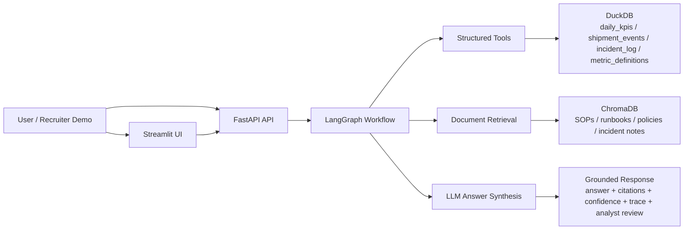

# Agentic Analytics Copilot for Enterprise Operations

Production-style internal AI system for KPI anomaly investigation across structured operational data and unstructured business knowledge.

## Problem Statement

Operations and analytics teams lose time investigating KPI drops across dashboards, raw events, incident logs, SOPs, and escalation policies. This project simulates an internal AI copilot that helps answer investigation questions such as:

- Why did delivery success rate drop in Region 3 yesterday?
- Which KPI moved abnormally this week?
- What does the runbook suggest we do next?
- When should this case be escalated to an analyst?

The goal is not to build a generic chatbot. The goal is to build a grounded, traceable, evaluation-aware workflow that looks closer to what enterprise AI teams are actually shipping.

## What The System Does

The system accepts a business investigation question through a FastAPI endpoint, routes the request through a LangGraph workflow, gathers evidence from both DuckDB tables and ChromaDB-retrieved documents, and produces a grounded answer with citations, confidence, trace steps, and analyst-review fallback.

## Architecture



## Core Features

- Natural-language KPI investigation over structured operational data
- Retrieval over metric definitions, SOPs, runbooks, policies, and incident notes
- LangGraph-based routing for structured-only, document-only, and hybrid questions
- Grounded answer generation with citations
- Confidence labels and `needs_analyst_review` fallback
- Workflow trace endpoint for debugging orchestration decisions
- Streamlit demo UI for recruiter-friendly exploration
- Local evaluation harness for route correctness, citations, trace depth, and answer presence
- Dockerized local startup path

## Tech Stack

### Backend and API

- `Python`
- `FastAPI`
- `Pydantic`

### Demo UI

- `Streamlit`
- `httpx`

### Structured Data

- `DuckDB`
- CSV seed datasets for KPI, shipment, incident, and metric-definition tables

### Unstructured Retrieval

- `ChromaDB`
- OpenAI embeddings via `text-embedding-3-small`

### Orchestration and LLM

- `LangGraph`
- OpenAI chat completions via `gpt-4.1-mini`

### Reliability and Evaluation

- structured logging
- `pytest`
- custom eval harness in `evals/run_eval.py`

### Packaging

- `Docker`
- `docker-compose`

## Data Sources

This MVP uses synthetic but realistic internal operations data:

- `daily_kpis`
- `shipment_events`
- `incident_log`
- `metric_definitions`

It also includes unstructured business knowledge:

- metric definition docs
- anomaly investigation SOP
- delivery disruption runbook
- escalation policy
- incident review note

## Request Flow

1. User submits a business question to `POST /ask`
2. Router classifies the question as structured, document, or hybrid
3. Workflow extracts region and metric where possible
4. Structured tools fetch KPI, anomaly, incident, and failure evidence from DuckDB
5. Retrieval layer fetches relevant document chunks from ChromaDB
6. LLM synthesizes an answer strictly from gathered evidence
7. Guardrails attach confidence, citations, trace, and analyst-review fallback

## API Endpoints

- `GET /health`: health check and runtime config visibility
- `POST /ask`: primary investigation endpoint
- `GET /debug/trace`: inspect routing and workflow trace for a question

## Demo Experience

The repo now includes a simple Streamlit app in `frontend/streamlit_app.py` that calls the FastAPI backend and renders:

- answer summary
- confidence and analyst-review status
- likely causes
- recommended next steps
- citations
- workflow trace
- raw JSON response

## Example Questions

- Why did delivery success rate drop in Region 3 on 2026-03-31?
- What does the escalation policy say about low-confidence cases?
- Why did delivery success rate drop in Region 3 and what does the SOP suggest we do next?
- Explain the return rate spike in Region 4.
- Which KPIs moved abnormally this week?

## Evaluation Approach

This project includes two layers of quality checks:

### Unit and integration-oriented tests

- routing logic
- chunking behavior
- answer guardrails
- workflow failure fallback
- service-layer mapping

Current local result:

- `12/12` tests passing

### Starter eval harness

The eval harness in `evals/run_eval.py` checks:

- route detection
- metric and region extraction
- citation presence
- trace depth
- answer presence

Current local starter result:

| Metric | Result |
|---|---|
| Eval cases | 4 |
| Average score | 1.0 |
| Coverage | route, trace, citations, answer presence |

This is intentionally a small MVP eval set, not a claim of full production readiness.

## Project Structure

```text
app/
  api/              # FastAPI routes
  core/             # config and logging
  db/               # DuckDB setup
  llm/              # prompts and answer synthesis
  orchestration/    # LangGraph workflow
  retrieval/        # chunking and ChromaDB access
  schemas/          # request/response models
  services/         # business logic
  tools/            # agent-callable tools
data/
  docs/             # SOPs, runbooks, policies, notes
  structured/       # source CSVs and DuckDB file
  vector/           # ChromaDB persistence
evals/
  datasets/         # evaluation questions
frontend/
  streamlit_app.py  # lightweight demo UI
tests/              # unit and workflow tests
```

## How To Run

### 1. Create and activate a virtual environment

```bash
python3 -m venv .venv
source .venv/bin/activate
```

### 2. Install dependencies

```bash
python -m pip install -e ".[dev]"
```

### 3. Configure environment variables

Create `.env` from the sample file:

```bash
cp .env.example .env
```

Then add your OpenAI API key to `.env`:

```env
OPENAI_API_KEY=sk-...
```

### 4. Initialize data stores

```bash
python scripts/init_duckdb.py
python scripts/index_documents.py
```

### 5. Run the API

```bash
python -m uvicorn app.main:app --reload
```

### 6. Run the Streamlit demo

In a second terminal:

```bash
streamlit run frontend/streamlit_app.py
```

### 7. Open the app surfaces

Visit:

```text
http://127.0.0.1:8000/docs
```

And for Streamlit:

```text
http://localhost:8501
```

### 8. Run tests and evals

```bash
python -m pytest
python evals/run_eval.py
```

## Sample Output Shape

The `POST /ask` endpoint returns:

- `answer`
- `confidence`
- `needs_analyst_review`
- `likely_causes`
- `recommended_next_steps`
- `citations`
- `trace`
- `evidence_summary`

## Limitations

- The current dataset is synthetic and intentionally small
- Eval coverage is still a starter harness rather than a large regression suite
- Confidence logic is heuristic and should be calibrated further
- Retrieval currently uses a simple chunking strategy without reranking
- The vector index is generated locally and intentionally excluded from source control
- Access control, auth, and role-based permissions are not implemented yet
- The current interface is API-first; a polished analyst-facing UI is the next step

## Why This Project Is Useful For Applied AI Roles

This project demonstrates:

- grounded retrieval across structured and unstructured data
- agent workflow orchestration instead of single-shot prompting
- reliability features like logging, traces, fallbacks, and structured outputs
- evaluation-aware development instead of demo-only development
- enterprise-style framing around business workflows and analyst review

## Future Work

- React-based multi-page analyst workspace with auth and richer state management
- richer SQL drafting and deeper investigation mode
- larger eval dataset with faithfulness and citation scoring
- prompt and retrieval regression tracking
- role-based views for analysts vs managers
- dashboard integration or incident-ticket integration
