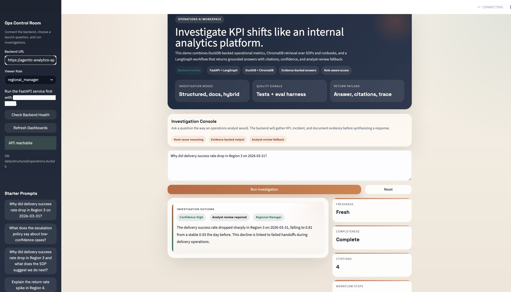
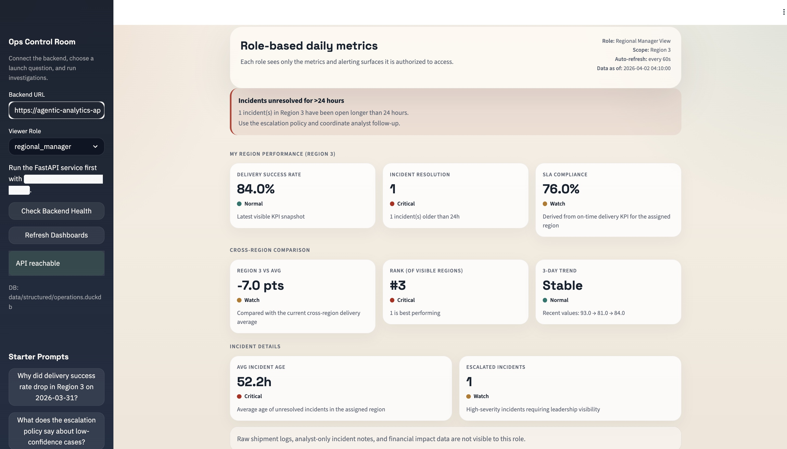
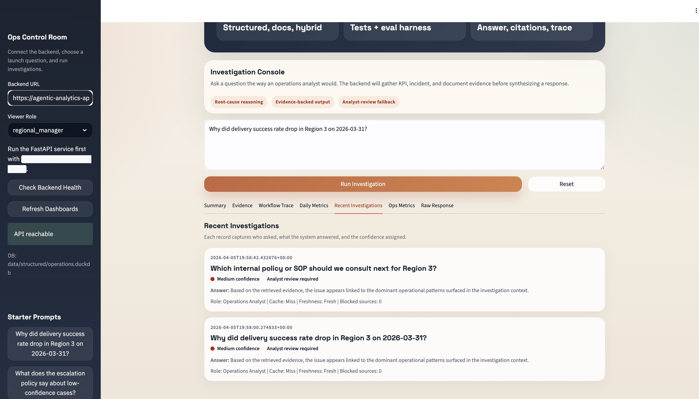
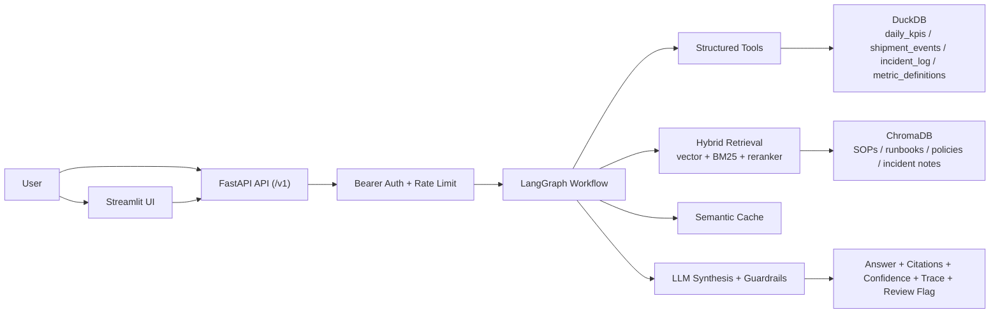

# Agentic Analytics Copilot for Enterprise Operations

[](https://agentic-analytics-streamlit.onrender.com)
[](https://agentic-analytics-api.onrender.com/docs)


> Live demo: [agentic-analytics-streamlit.onrender.com](https://agentic-analytics-streamlit.onrender.com)  
> API docs: [agentic-analytics-api.onrender.com/docs](https://agentic-analytics-api.onrender.com/docs)

## Overview

This project simulates a production-style internal AI system for operations teams investigating KPI anomalies across both structured data and unstructured business knowledge.

Instead of acting like a generic chatbot, it routes questions through a LangGraph workflow, retrieves grounded evidence from DuckDB and ChromaDB, enforces role-based access, and returns answers with citations, confidence, workflow trace, and analyst-review fallback.

What makes it different from a typical student AI repo:

- hybrid investigation across KPIs, incidents, runbooks, SOPs, and policies
- role-aware access control and blocked-source handling
- confidence breakdown, freshness, completeness, and analyst-review safeguards
- daily metrics dashboard with alerts
- investigation history / audit trail
- suggested follow-up questions
- live hosted demo with reliability fallbacks for free-tier deployment

---

## Demo

### Full app overview



### Daily metrics dashboard



### Recent investigations



### Suggested follow-up flow


### Confidence breakdown


### Workflow trace


---

## What It Does

The system supports three investigation modes:

- `structured_only`: KPI and incident analysis from DuckDB
- `documents_only`: SOP, runbook, and policy retrieval from ChromaDB
- `hybrid`: combined metric evidence plus document guidance

It returns:

- grounded answer
- citations
- confidence label
- confidence breakdown
- freshness and completeness signals
- blocked sources
- workflow trace
- analyst-review reason
- request ID, latency, and cache status

The Streamlit app also includes:

- `Daily Metrics` tab with role-based operational dashboards and alert banners
- `Recent Investigations` tab with audit history
- `Ops Metrics` tab with request metrics, latency, token totals, and estimated cost
- suggested follow-up questions that continue the investigation in one click

---

## Architecture



---

## Key Features

- Natural-language KPI investigation over structured operational data
- Raw-to-curated pipeline over messy bronze-style feeds
- Data quality checks for duplicates, normalization, coverage, freshness, and completeness
- Hybrid retrieval with vector search, BM25 keyword scoring, reciprocal rank fusion, and reranking
- LangGraph orchestration for structured, document, and hybrid routes
- Role-aware access control across tables and doc groups
- Versioned `/v1` API with bearer auth and request rate limiting
- Semantic cache for repeated questions
- Streaming investigation endpoint
- Confidence guardrails with analyst-review fallback
- Freshness and completeness-aware outputs
- Daily metrics dashboard with threshold-based alerts
- Investigation history / audit trail
- Suggested follow-up questions
- Local fallback mode so the hosted Streamlit demo still works during API cold starts or transient failures
- Optional Langfuse hooks for observability
- GitHub Actions CI and eval gate support

---

## Tech Stack

**Backend**

- Python
- FastAPI
- Pydantic

**Orchestration and LLM**

- LangGraph
- OpenAI chat completions via `gpt-4.1-mini`

**Structured data**

- DuckDB
- curated CSV serving tables

**Retrieval**

- ChromaDB
- OpenAI embeddings via `text-embedding-3-small`
- `rank-bm25`
- sentence-transformers reranker

**Frontend**

- Streamlit
- httpx

**Reliability**

- semantic cache
- SQLite-backed observability
- pytest
- custom eval harness
- GitHub Actions

**Deployment**

- Render
- Docker / docker-compose

---

## API Surface

- `GET /v1/health`
- `POST /v1/ask`
- `POST /v1/ask/stream`
- `GET /v1/debug/trace`
- `GET /v1/debug/metrics`
- `GET /v1/history`
- `GET /v1/metrics/dashboard`

Direct API calls require a bearer token. The local Streamlit app generates demo tokens automatically from the selected role.

To mint a demo token locally:

```bash
python -c "from app.core.auth import create_demo_token; print(create_demo_token('operations_analyst'))"
```

---

## Evaluation

The project includes both tests and a broader eval harness.

Current project quality indicators:

| Metric | Result |
|---|---|
| Eval cases | 51 |
| Test suite | 31/31 passing |
| Coverage | route, citations, trace, freshness, blocked-source behavior, retrieval precision/recall, scenario slices |

The eval harness checks:

- route detection
- region and metric extraction
- citation presence
- trace depth
- answer presence
- freshness and blocked-source expectations
- retrieval precision and recall
- scenario-tag summaries for stale, lagging, restricted, ambiguous, and low-evidence cases
- optional LLM-as-judge scoring

---

## Data Model

This project uses synthetic but realistic enterprise-style data.

Raw bronze feeds:

- `data/raw/bronze/kpi_feed.csv`
- `data/raw/bronze/shipment_event_feed.csv`
- `data/raw/bronze/incident_feed.csv`
- `data/raw/bronze/metric_catalog.csv`

Curated serving tables:

- `daily_kpis`
- `shipment_events`
- `incident_log`
- `metric_definitions`

Unstructured knowledge base:

- SOPs
- runbooks
- policies
- metric definition docs
- incident notes

The raw feeds intentionally include:

- duplicates
- inconsistent metric and region names
- delayed timestamps
- stale and incomplete data scenarios

---

## Run Locally

```bash
python3 -m venv .venv
source .venv/bin/activate
python -m pip install -e ".[dev]"
cp .env.example .env
python scripts/init_duckdb.py
python scripts/index_documents.py
python -m uvicorn app.main:app --reload
streamlit run frontend/streamlit_app.py
```

Then open:

- `http://127.0.0.1:8000/docs`
- `http://localhost:8501`

Run tests and evals:

```bash
python -m pytest
python evals/run_eval.py
```

---

## Project Structure

```text
app/
  api/            # versioned FastAPI routes
  core/           # auth, cache, observability, config
  db/             # DuckDB bootstrap
  llm/            # prompts and synthesis
  orchestration/  # LangGraph workflow
  retrieval/      # vector search, BM25, reranking
  schemas/        # request/response models
  services/       # business logic
  tools/          # agent-callable tool wrappers
data/
  raw/            # bronze-style feeds
  structured/     # curated sources and DuckDB
  docs/           # SOPs, runbooks, policies, notes
  vector/         # Chroma persistence
  cache/          # semantic cache SQLite file
evals/
  datasets/       # eval questions and gold labels
frontend/
  streamlit_app.py
tests/
  unit and workflow tests
render.yaml
```

---

## Why This Project Is Strong For Applied AI Roles

It demonstrates:

- hybrid retrieval over structured and unstructured sources
- agent workflow orchestration instead of single-shot prompting
- enterprise framing around access control, traceability, and analyst review
- eval-driven development instead of demo-only development
- production-minded backend work: auth, rate limiting, caching, observability, CI, deployment

---

## Limitations

- The dataset is synthetic and intentionally small, even though it includes realistic failure modes
- Confidence scoring is still heuristic and could be calibrated further
- The hosted demo is optimized for reliability on Render free tier, not maximum retrieval depth
- The auth flow is a demo bearer-token model, not a real identity provider
- The current UI is a polished demo surface, not a full internal product

---

## Future Work

- external identity provider / SSO
- proactive anomaly detection and alert dispatch
- richer SQL drafting and investigation depth
- deeper confidence calibration
- more robust hosted document indexing
- ticketing / Slack integration

---

## Live Links

- Streamlit: [https://agentic-analytics-streamlit.onrender.com](https://agentic-analytics-streamlit.onrender.com)
- API: [https://agentic-analytics-api.onrender.com](https://agentic-analytics-api.onrender.com)
- API docs: [https://agentic-analytics-api.onrender.com/docs](https://agentic-analytics-api.onrender.com/docs)
